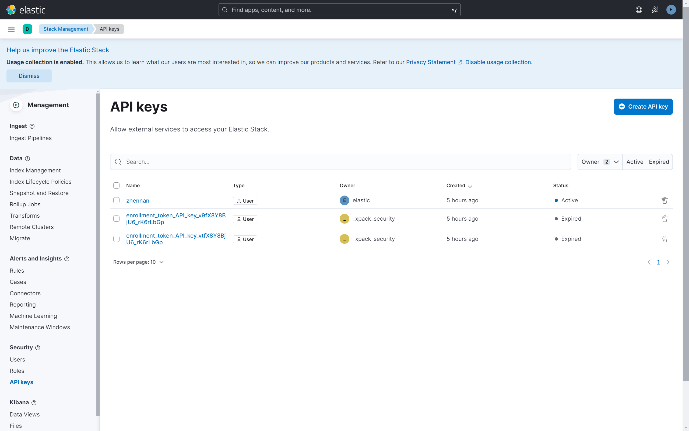

# Install and use elasticsearch

### 1. Install elasticsearch

Adapted from https://github.com/elastic/elasticsearch

**Install and start Docker Desktop. https://www.docker.com/products/docker-desktop**

Go to Preferences > Resources > Advanced and set Memory to at least 4GB.

If WSL, create file "C:\Users\ 'UserName' \ .wslconfig", paste and save the following:
```
[wsl2]
memory=8GB   # 设置WSL 2可以使用的最大内存，不少于4GB，这里是8GB
```
Then run the following in the Windows terminal:
```bash
wsl --shutdown
```
Then restart the wsl.

**Run Elasticsearch and Kibana using Docker**

**Start Elasticsearch**

```bash
docker network create elastic
docker pull docker.elastic.co/elasticsearch/elasticsearch:8.13.4
docker run --name elasticsearch --net elastic -p 9200:9200 -p 9300:9300 -e "discovery.type=single-node" -t docker.elastic.co/elasticsearch/elasticsearch:8.13.4
```

Save the INFO at the end of terminal output like this:
```
✅ Elasticsearch security features have been automatically configured!
✅ Authentication is enabled and cluster connections are encrypted.

ℹ️  Password for the elastic user (reset with `bin/elasticsearch-reset-password -u elastic`):
  aAwnuMHrnenWc2u3J1Lq

ℹ️  HTTP CA certificate SHA-256 fingerprint:
  d2529951ddf0a18d42c3960ce8b6b68c61aad195ae79b9fa497f8f71e2ccd014

ℹ️  Configure Kibana to use this cluster:
• Run Kibana and click the configuration link in the terminal when Kibana starts.
• Copy the following enrollment token and paste it into Kibana in your browser (valid for the next 30 minutes):
  eyJ2ZXIiOiI4LjEzLjQiLCJhZHIiOlsiMTcyLjE4LjAuMjo5MjAwIl0sImZnciI6ImQyNTI5OTUxZGRmMGExOGQ0MmMzOTYwY2U4YjZiNjhjNjFhYWQxOTVhZTc5YjlmYTQ5N2Y4ZjcxZTJjY2QwMTQiLCJrZXkiOiJ3ZGZYOFk4QmpVNl9ySzZyTGJHcTpTRUxVLVpCblFYYW5fSklDeWFXZ19nIn0=

ℹ️ Configure other nodes to join this cluster:
• Copy the following enrollment token and start new Elasticsearch nodes with `bin/elasticsearch --enrollment-token <token>` (valid for the next 30 minutes):
  eyJ2ZXIiOiI4LjEzLjQiLCJhZHIiOlsiMTcyLjE4LjAuMjo5MjAwIl0sImZnciI6ImQyNTI5OTUxZGRmMGExOGQ0MmMzOTYwY2U4YjZiNjhjNjFhYWQxOTVhZTc5YjlmYTQ5N2Y4ZjcxZTJjY2QwMTQiLCJrZXkiOiJ3TmZYOFk4QmpVNl9ySzZyTGJHcDotRFk1MUpUTlNhQ01VNWtLTng5LVB3In0=

  If you're running in Docker, copy the enrollment token and run:
  `docker run -e "ENROLLMENT_TOKEN=<token>" docker.elastic.co/elasticsearch/elasticsearch:8.13.4`
```

**Start Kibana**

```bash
docker pull docker.elastic.co/kibana/kibana:8.13.4
docker run --name kibana --net elastic -p 5601:5601 docker.elastic.co/kibana/kibana:8.13.4
```

Then visit the URL at the end of terminal output like http://localhost:5601/?code=575783

Paste the enrollment token that you copied when starting Elasticsearch and click the button to connect your Kibana instance with Elasticsearch.
```
eyJ2ZXIiOiI4LjEzLjQiLCJhZHIiOlsiMTcyLjE4LjAuMjo5MjAwIl0sImZnciI6ImQyNTI5OTUxZGRmMGExOGQ0MmMzOTYwY2U4YjZiNjhjNjFhYWQxOTVhZTc5YjlmYTQ5N2Y4ZjcxZTJjY2QwMTQiLCJrZXkiOiJ3TmZYOFk4QmpVNl9ySzZyTGJHcDotRFk1MUpUTlNhQ01VNWtLTng5LVB3In0=
```

Log in to Kibana as the elastic user with the password that was generated when you started Elasticsearch.
```
elastic
aAwnuMHrnenWc2u3J1Lq
```

**Generate API key**

Click 'management' on the left bar, and click Security>API keys on the left bar.

Create an API key, and copy this key now. You will not be able to view it again.



### 2. Use elasticsearch

Please ensure your disk space is enough (maybe >10G)

Download the dataset and move to the same folder as import.py:
https://cloud.tsinghua.edu.cn/d/f9740c3db9d640b48655/

Install necessary packages: (You can create a virtual environment using miniconda)
```bash
python -m pip install elasticsearch
pip install ijson
```

Run import.py:
```bash
python import.py # 注意替换API key
```
Wait about ~10 minutes.

And finally you will see the following in your bash:
```bash
Successfully indexed 3505391 documents.
```

Check if the import was successful:
```bash
export ELASTIC_PASSWORD="aAwnuMHrnenWc2u3J1Lq" # 注意替换密码
docker cp elasticsearch:/usr/share/elasticsearch/config/certs/http_ca.crt .
curl --cacert http_ca.crt -u elastic:$ELASTIC_PASSWORD -X GET "https://localhost:9200/my_index/_search" -H 'Content-Type: application/json' -d'
{
  "query": {
    "match": {
      "label": "天气"
    }
  }
}'
```

Result:
```json
{"took":12,"timed_out":false,"_shards":{"total":1,"successful":1,"skipped":0,"failed":0},"hits":{"total":{"value":10000,"relation":"gte"},"max_score":13.193249,"hits":[{"_index":"my_index","_id":"bdi2464891","_score":13.193249,"_ignored":["description.keyword"],"_source":{"label":"天气","type":"instance","source":"bd","description":"[[bd2464891|天气]]是指某一个地区距离地表较近的大气层在短时间内的具体状态。而天气现象则是指发生在大气中的各种自然现象，即某瞬时内大气中各种气象要素（如 [[bd4682361|气温]]、 [[bd4681382|气压]]、 [[bd5128335|湿度]]、风、云、雾、雨、闪、雪、霜、雷、雹、霾等）空间分布的综合表现。::;天气过程就是一定地区的 [[bd2464990|天气现象]]随时间的变化过程。各种 [[bd2465006|天气系统]]都具有一定的空间尺度和时间尺度，而且各种尺度系统间相互交织、相互作用。许多天气系统的组合，构成大范围的天气形势，构成半球甚至全球的 [[bd2401722|大气环流]]。天气系统总是处在不断新生、发展和消亡过程中，在不同发展阶段有着其相对应的天气现象分布。","concepts":[{"id":"bdc32484","label":"科学百科环境生态分类"},{"id":"bdc9966","label":"自然现象"},{"id":"bdc3313","label":"自然"}],"instances":[{"id":"bdi7192065","label":"远古时代"},{"id":"bdi2507267","label":"太阳"},{"id":"bdi6403245","label":"能见度"},{"id":"bdi893002","label":"交通"}],"properties":[{"id":"bdp158","key":"属于","value":"自然天气现象"},{"id":"bdp711","key":"影响","value":"居家和出行的重要指标"},{"id":"bdp274047","key":"常见天气","value":"风云雾雨雪霜"},{"id":"bdp9","key":"外文名","value":"weather"},{"id":"bdp1859","key":"涵义","value":"大气状态"},{"id":"bdp1","key":"中文名","value":"天气"}],"url":"https://baike.baidu.com/item/%E5%A4%A9%E6%B0%94%2F24449"}},{"_index":"my_index","_id":"bdi2464893","_score":13.193249,"_source":{"label":"天气","type":"instance","source":"bd","description":"天气是指在较短时间内特定地区的 大气状况，出自太平天囯 [[bd4907785|洪仁玕]]《自传》。","concepts":[],"instances":[{"id":"bdi6909271","label":"诉衷情"},{"id":"bdi8172348","label":"黄庭坚"},{"id":"bdi4810184","label":"沙尘暴"},{"id":"bdi4701999","label":"水浒传"}],"properties":[{"id":"bdp1","key":"中文名","value":"天气"},{"id":"bdp662","key":"基本解释","value":"在较短时间内特定地区的 [[bdi2401463|大气]]状况"},{"id":"bdp9","key":"外文名","value":"weather"},{"id":"bdp2211","key":"泛指","value":"[[bdi5933964|空气]]"}],"url":"https://baike.baidu.com/item/%E5%A4%A9%E6%B0%94%2F332535"}},{"_index":"my_index","_id":"bdi2464890","_score":13.193249,"_source":{"label":"天气","type":"instance","source":"bd","description":"[[bd5103934|游戏王卡组]]系列之一。登场于新型卡包Deck Build Pack第1弹Spirit Warriors（DBSW）的系列。::;特色是使用连接怪兽或永续魔法·永续陷阱卡赋予相邻的「天气」效果怪兽以除外自身作为COST的干扰性效果，且「天气」效果怪兽本身就有作为「天气」效果COST除外则在下个回合的准备阶段特殊召唤的再生效果。","concepts":[{"id":"bdc25120","label":"娱乐"}],"instances":[{"id":"bdi5103934","label":"游戏王卡组"}],"properties":[{"id":"bdp38","key":"游戏类型","value":"[[bdi7757895|集换式卡牌游戏]]"},{"id":"bdp1","key":"中文名","value":"天气"},{"id":"bdp687","key":"日文名","value":"天気(てんき)"},{"id":"bdp929","key":"所属游戏","value":"游戏王"},{"id":"bdp95","key":"英文名","value":"The Weather"},{"id":"bdp209","key":"发行商","value":"[[bdi175603|KONAMI]]"}],"url":"https://baike.baidu.com/item/%E5%A4%A9%E6%B0%94%2F21511882"}},{"_index":"my_index","_id":"bdi2464927","_score":12.195388,"_source":{"label":"天气和气候","type":"instance","source":"bd","description":"《天气和气候》是2008年电子工业出版社出版的图书。","concepts":[{"id":"bdc18567","label":"工业书籍"},{"id":"bdc7948","label":"出版物"},{"id":"bdc17963","label":"书籍"}],"instances":[],"properties":[{"id":"bdp176","key":"丛书名","value":"DiscoveryEducation科学课"},{"id":"bdp1","key":"中文名","value":"天气和气候"},{"id":"bdp5","key":"出版社","value":"电子工业出版社"},{"id":"bdp352","key":"平装","value":"32页"}],"url":"https://baike.baidu.com/item/%E5%A4%A9%E6%B0%94%E5%92%8C%E6%B0%94%E5%80%99"}},{"_index":"my_index","_id":"bdi2464983","_score":12.195388,"_source":{"label":"天气气候学","type":"instance","source":"bd","description":"天气气侯学是气候学的一个分支,是以天气学的观点和方法来研究气候形成及其变化规律的学科。天气气侯学主要研究长时期内平均环流、环流型式与天气系统相互作用以及大气环流与大范围气候异常的关系等问题,为提高某地区天气预报准确率和阐明气候形成理论提供重要依据。其研究工具主要为天气图和气压配置图。未来天气气侯学将会采取更多定量分析的方法。","concepts":[{"id":"bdc32484","label":"科学百科环境生态分类"},{"id":"bdc27821","label":"非地理"},{"id":"bdc18653","label":"气候学"},{"id":"bdc17225","label":"大气科学"},{"id":"bdc10428","label":"地理学"},{"id":"bdc31911","label":"学科名"}],"instances":[{"id":"bdi7564534","label":"长期天气预报"},{"id":"bdi2215399","label":"圣彼得堡"}],"properties":[{"id":"bdp989","key":"主要内容","value":"平均环流、环流型、 [[bdi5494801|环流指数]]"},{"id":"bdp1","key":"中文名","value":"天气气候学"},{"id":"bdp60","key":"分类","value":"动力气候学、静力气候学"},{"id":"bdp295","key":"建立时间","value":"1874年"},{"id":"bdp9","key":"外文名","value":"synoptic climatology"}],"url":"https://baike.baidu.com/item/%E5%A4%A9%E6%B0%94%E6%B0%94%E5%80%99%E5%AD%A6"}},{"_index":"my_index","_id":"bdi2477703","_score":11.953121,"_source":{"label":"天然气","type":"instance","source":"bd","description":"天然气是指自然界中天然存在的一切气体，包括 大气圈、 水圈、和 岩石圈中各种自然过程形成的气体（包括 油田气、气田气、 泥火山气、 煤层气和 生物生成气等）。::;而人们长期以来通用的“天然气”的定义，是从能量角度出发的 狭义定义，是指天然蕴藏于地层中的 [[bd5223992|烃]]类和非烃类气体的混合物。在 [[bd5776189|石油地质学]]中，通常指油田气和气田气。其组成以烃类为主，并含有非烃气体。","concepts":[{"id":"bdc32485","label":"科学百科工程技术分类"},{"id":"bdc24480","label":"学科"},{"id":"bdc32485","label":"科学百科工程技术分类"},{"id":"bdc24480","label":"学科"}],"instances":[{"id":"bdi5775763","label":"石油"},{"id":"bdi5249132","label":"煤炭"},{"id":"bdi5248579","label":"煤"},{"id":"bdi5008654","label":"液化石油气"}],"properties":[{"id":"bdp1","key":"中文名","value":"天然气"},{"id":"bdp9","key":"外文名","value":"Natural gas"},{"id":"bdp62743","key":"天然气","value":"tiān rán qì"},{"id":"bdp1","key":"中文名","value":"天然气"},{"id":"bdp9","key":"外文名","value":"Natural gas"},{"id":"bdp62743","key":"天然气","value":"tiān rán qì"}],"url":"https://baike.baidu.com/item/%E5%A4%A9%E7%84%B6%E6%B0%94%2F36482"}},{"_index":"my_index","_id":"bdi248831","_score":11.953121,"_source":{"label":"V天气","type":"instance","source":"bd","description":"《V天气》是一款集成了当今各大门户网站的天气栏目，软件大小是0.64 MB。","concepts":[{"id":"bdc12187","label":"软件"},{"id":"bdc28962","label":"安卓软件"}],"instances":[],"properties":[{"id":"bdp24","key":"类别","value":"天气旅游"},{"id":"bdp1","key":"中文名","value":"[[bdi248831|V天气]]"},{"id":"bdp7132","key":"开发作者","value":"Android"},{"id":"bdp134","key":"大小","value":"0.64 MB"}],"url":"https://baike.baidu.com/item/V%E5%A4%A9%E6%B0%94"}},{"_index":"my_index","_id":"bdi2484426","_score":11.953121,"_source":{"label":"天罡气","type":"instance","source":"bd","description":"","concepts":[{"id":"bdc17963","label":"书籍"},{"id":"bdc15571","label":"梦幻西游"}],"instances":[{"id":"bdi876183","label":"五雷轰顶"},{"id":"bdi7784404","label":"雷霆万钧"},{"id":"bdi2481551","label":"天神护体"}],"properties":[{"id":"bdp24","key":"类别","value":"门派技能"},{"id":"bdp1","key":"中文名","value":"天罡气填写人物中文名或其中文译名"},{"id":"bdp4740","key":"所属门派","value":"[[bdi2456962|天宫]]"},{"id":"bdp23775","key":"学习效果","value":"按技能等级提高伤害力"}],"url":"https://baike.baidu.com/item/%E5%A4%A9%E7%BD%A1%E6%B0%94"}},{"_index":"my_index","_id":"bdi2464931","_score":11.953121,"_source":{"label":"天气图","type":"instance","source":"bd","description":"天气图是指填有各地同一时间 气象要素的特制地图，是目前气象部门分析和预报天气的一种重要工具。","concepts":[{"id":"bdc32484","label":"科学百科环境生态分类"},{"id":"bdc22323","label":"科学"},{"id":"bdc22247","label":"气象"},{"id":"bdc17225","label":"大气科学"},{"id":"bdc14829","label":"天气学"},{"id":"bdc18649","label":"气象名词"},{"id":"bdc22323","label":"科学"},{"id":"bdc1542","label":"自然科学"}],"instances":[{"id":"bdi1016669","label":"传真"},{"id":"bdi4683351","label":"气象卫星"},{"id":"bdi2401722","label":"大气环流"}],"properties":[{"id":"bdp292","key":"创建时间","value":"1820年"},{"id":"bdp277","key":"创始人","value":"H.W.布兰德斯"},{"id":"bdp9","key":"外文名","value":"weather map"},{"id":"bdp234","key":"组成","value":"辅助图、地面天气、高空天气"},{"id":"bdp1","key":"中文名","value":"天气图"},{"id":"bdp131","key":"作用","value":"气象部门分析预报天气的重要工具"}],"url":"https://baike.baidu.com/item/%E5%A4%A9%E6%B0%94%E5%9B%BE"}},{"_index":"my_index","_id":"bdi2245320","_score":11.953121,"_source":{"label":"坏天气","type":"instance","source":"bd","description":"坏天气为 孙燕姿的第二张专辑《 我要的幸福》中歌曲，于2000年12月7日发行。","concepts":[{"id":"bdc16459","label":"音乐作品"},{"id":"bdc16459","label":"音乐作品"}],"instances":[{"id":"bdi3544941","label":"愚人的国度"},{"id":"bdi1933210","label":"同类"},{"id":"bdi534051","label":"世说心语"},{"id":"bdi4002036","label":"明日的记忆"}],"properties":[{"id":"bdp69","key":"发行时间","value":"2000年12月"},{"id":"bdp347","key":"演唱者","value":"孙燕姿"},{"id":"bdp82","key":"所属专辑","value":"我要的幸福"},{"id":"bdp16","key":"中文名称","value":"坏天气"},{"id":"bdp69","key":"发行时间","value":"2000年12月"},{"id":"bdp347","key":"演唱者","value":"孙燕姿"},{"id":"bdp82","key":"所属专辑","value":"我要的幸福"},{"id":"bdp16","key":"中文名称","value":"坏天气"}],"url":"https://baike.baidu.com/item/%E5%9D%8F%E5%A4%A9%E6%B0%94%2F6262"}}]}}
```

Then you can move on.