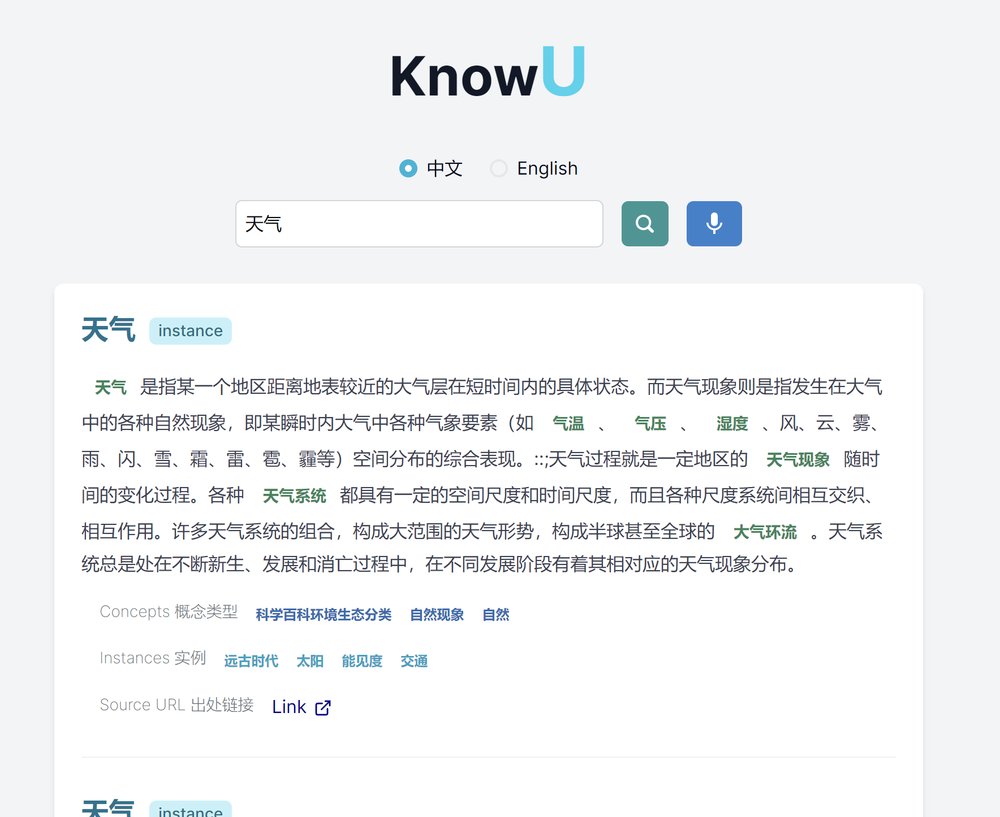

# 前端

## 1. 用户界面

前端我们使用的是 Next.js 14 来实现。主要有 “搜索主页”，“搜索结果列表展示页面” 和 “结果详情展示页面”。

### 1.1 搜索主页


在这个搜索主页里，用户可以选择想要输入的是英文还是中文的询问。

### 1.1.1 语音搜索

在点击带有麦克风标识的按钮后，页面将会弹出一个提示框显示引擎正在读取语音。


语音所能接受的语言基于用户所在页面设置的选项。在实现实时语音转文字的功能时，我们使用的是 [webkitSpeechRecognition API](https://developer.mozilla.org/en-US/docs/Web/API/Web_Speech_API/Using_the_Web_Speech_API)。这个语音识别涉及通过设备的麦克风接收语音，然后通过语音识别服务根据语法列表（中文或英文）进行检查。当成功识别单词或短语时，它将作为结果文本字符串列表返回。我们只取第一个结果作为返回并设置为用户的 query。

（我们发现当用户设置语言为中文时，此 API 也能基于一些简单的英文语音输入返回英文词汇的识别）

### 1.1.2 查询自动补全推荐

当用户输入内容时，我们的搜索引擎也会将输入内容作为前缀，实时返回前十个自动补全推荐。

#### a. 英文自动补全推荐

这个功能我们是利用 [datamuse API](https://www.datamuse.com/api/) 来实现。DataMuse API 是一个面向开发者的在线服务，提供了一系列用于查询和处理词汇数据的接口。这个 API 特别适合那些需要对词汇、同义词、反义词、单词定义等进行查询的应用程序，也就比如我们的知识搜索引擎。DataMuse API 是免费提供的，不需要 API 密钥，并且可以直接通过 HTTP 请求来使用。返回时，我们只提取前 10 的结果展示给用户选择。


#### b. 中文自动补全推荐

我们在网上找了一个附有词频的 [中文常用词表](https://github.com/ling0322/webdict/tree/00430ba2cde04d19a78b34ddb87da2d931231877), 并把它转换成 json 格式加载到前端。在于处理中，我们遍历字典中的每个词，获取其所有子串及其频率的列表。之后创建一个新的映射，将子串映射到它们的频率。我们遍历列表中的每个子串，检查这个子串的所有前缀。如果某个前缀的频率乘以 10 小于子串的频率，那么这个前缀就会被从映射中删除。将映射转换回列表，并按每个子串频率乘以其长度的值排序。这个列表随后被赋值回字典中对应词的地方。当用户进行输入时，我们会根据输入的前缀返回一个前十建议的词列表。如果输入的前缀不在字典中，那么它会返回一个空列表。这个列表将会在前端展现供用户选择。


这个实现我们参考了这个 [github](https://github.com/namasikanam/Arouq/tree/master) 的实现方法。

## 1.2 搜索结果列表展示页面

当用户提交查询后，后端会返回搜索结果的列表。前端会将返回内容进行**结构化的信息呈现**。

主要返回的信息如以下：

```json
{
  answer: "",
  content: [
    {
      id: "",
      label: "",
      type: "",
      source: "",
      description:
        "",
      concepts: [{ id: "", label: "" }, ...],
      hypernymy: [{ id: "", label: "" }, ...],
      hyponymy: [{ id: "", label: "" },...],
      instances: [{ id: "", label: "" }, ...],
      url: "",
    },
```

若返回的信息里某一项的长度为零，那么我们就不会在前端展示那一项。

以下是个返回实例(instance)列表的例子:



以下是个返回概念(concept)列表的例子:
就比如这里会出现上位关系列表和下为关系列表的内容，而没有出现简介有关的内容


一下是个返回知识问答(answer)的例子：


## 1.3 

在 _“搜索结果列表展示页面”_ 里出现带有颜色的字体都以转化为按钮。当用户点击之后, 就会根据 id 向后端发送请求后 **跳转至** _“结果详情展示页面”_。

这里展示的内容信息结构：

```json
{
  answer: "",
  content: [
    {
      id: "",
      label: "",
      type: "",
      source: "",
      description:
        "",
      concepts: [{ id: "", label: "" }, ...],
      hypernymy: [{ id: "", label: "" }, ...],
      hyponymy: [{ id: "", label: "" },...],
      instances: [{ id: "", label: "" }, ...],
      properties: [{ id: "", key: "", value: [] }, ...],
      url: "",
    },
```

和以上的不同是这里增加了`properties`这一项。

以下是 _“搜索结果列表展示页面”_ 的内容样例：


我们的搜索引擎基本实现了以下功能：

- 支持中英文语音搜索
- 中英文的查询自动补全推荐
- 知识实体的搜索
- 知识问答
- 信息的结构化展示
  - 支持实体跳转和外部链接(URL)跳转

更多的详细介绍请参考以下内容
